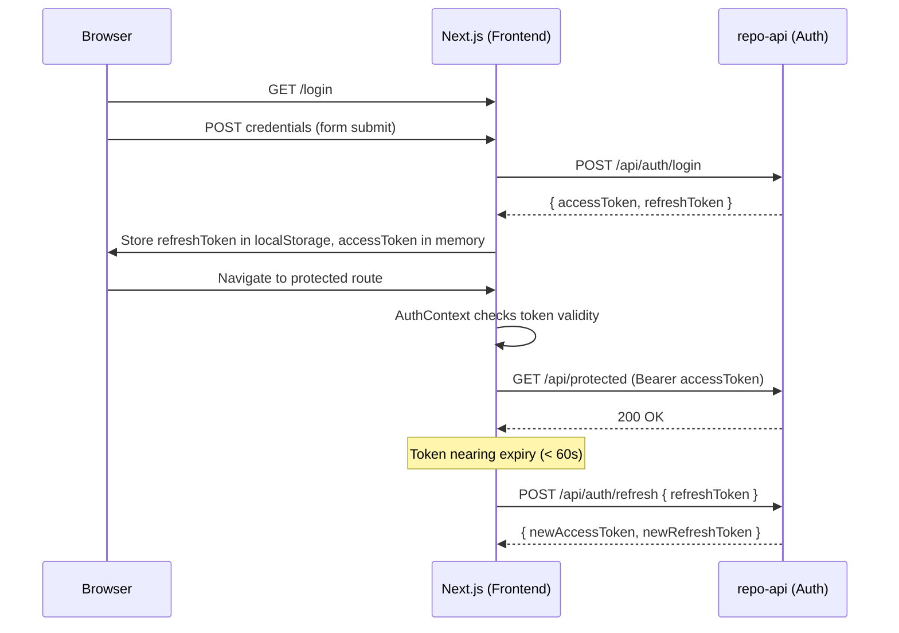

# Design Document: User Authentication

## Overview

This document describes the technical design for adding user authentication to AltersSearch. The system spans two services:

- **repo-api** (Node.js/Express, port 4000) — gains four new auth endpoints, a JWT-based middleware, and an in-memory token store.
- **frontend** (Next.js/TypeScript, port 3000) — gains login and registration pages, a React Auth Context, protected-route logic, and a dynamic Topbar.

Authentication uses a dual-token strategy: a short-lived **Access Token** (JWT, 15 min) for API authorization and a long-lived **Refresh Token** (opaque 64-byte hex, 7 days) for silent session renewal. Refresh tokens are rotated on every use to limit the blast radius of token theft.

The design deliberately avoids introducing a database dependency into repo-api. The Token Store is an in-memory `Map` for the initial implementation, with a clear interface that can be swapped for a Redis or database-backed store later.

---

## Architecture



```mermaid
graph TD
    subgraph repo-api
        R[POST /api/auth/register] --> US[UserStore]
        L[POST /api/auth/login] --> US
        L --> TS[TokenStore]
        RF[POST /api/auth/refresh] --> TS
        LO[POST /api/auth/logout] --> TS
        MW[authenticate middleware] --> JWT[JWT verify]
    end

    subgraph frontend
        AC[AuthContext / AuthProvider] --> LS[localStorage - refreshToken]
        AC --> MS[React state - accessToken + user]
        LP[/login page] --> AC
        RP[/register page] --> AC
        PR[ProtectedRoute wrapper] --> AC
        TB[Topbar] --> AC
    end

    frontend -->|HTTP requests| repo-api
```

---

## Components and Interfaces

### Backend — repo-api

#### File structure additions

```
repo-api/src/
  auth/
    router.js          # Express router mounting all /api/auth/* routes
    handlers.js        # register, login, refresh, logout handler functions
    middleware.js      # authenticate() middleware
    tokenStore.js      # In-memory TokenStore implementation
    userStore.js       # In-memory UserStore implementation
    utils.js           # generateRefreshToken(), getInitials() helpers
  server.js            # (existing) — mounts auth router
```

#### UserStore interface

```js
// userStore.js
class UserStore {
  // Returns the created user { id, email, passwordHash } or throws if email taken
  create(email, passwordHash): User

  // Returns user by email or null
  findByEmail(email): User | null

  // Returns user by id or null
  findById(id): User | null
}
```

#### TokenStore interface

```js
// tokenStore.js
class TokenStore {
  // Stores a refresh token entry
  save(token, { userId, expiresAt }): void

  // Returns the entry or null
  find(token): { userId, expiresAt } | null

  // Removes the token; no-op if not found
  revoke(token): void
}
```

#### Auth Router — endpoint summary

| Method | Path | Auth required | Description |
|--------|------|---------------|-------------|
| POST | `/api/auth/register` | No | Create account |
| POST | `/api/auth/login` | No | Issue tokens |
| POST | `/api/auth/refresh` | No | Rotate tokens |
| POST | `/api/auth/logout` | No | Revoke refresh token |

#### authenticate middleware signature

```js
// middleware.js
function authenticate(req, res, next) {
  // Extracts Bearer token from Authorization header
  // Verifies JWT signature and expiry
  // On success: attaches { id, email } to req.user, calls next()
  // On failure: returns 401 with appropriate message
}
```

#### Request / Response shapes

**POST /api/auth/register**
```
Request:  { email: string, password: string }
Response 201: { id: string, email: string }
Response 400: { message: string }
Response 409: { message: "Email already registered." }
```

**POST /api/auth/login**
```
Request:  { email: string, password: string }
Response 200: { accessToken: string, refreshToken: string }
Response 401: { message: "Invalid credentials." }
```

**POST /api/auth/refresh**
```
Request:  { refreshToken: string }
Response 200: { accessToken: string, refreshToken: string }
Response 401: { message: "Invalid refresh token." | "Refresh token expired." }
```

**POST /api/auth/logout**
```
Request:  { refreshToken: string }
Response 200: { message: "Logged out." }
```

---

### Frontend — Next.js

#### File structure additions

```
frontend/src/
  app/
    login/
      page.tsx           # Login page at /login
    register/
      page.tsx           # Registration page at /register
  contexts/
    AuthContext.tsx       # AuthProvider + useAuth hook
  components/
    ProtectedRoute.tsx    # Wrapper that redirects unauthenticated users
    Topbar.tsx            # (existing) — updated to consume AuthContext
  lib/
    authApi.ts            # Typed wrappers for auth API calls
    tokenUtils.ts         # decodeToken(), isTokenExpired(), getInitials()
```

#### AuthContext shape

```ts
// contexts/AuthContext.tsx
interface User {
  id: string;
  email: string;
}

interface AuthContextValue {
  user: User | null;
  isAuthenticated: boolean;
  login(email: string, password: string): Promise<void>;
  logout(): Promise<void>;
}

// Exposed hook
function useAuth(): AuthContextValue
```

#### AuthProvider behaviour

1. On mount: reads `refreshToken` from `localStorage`. If present, decodes the in-memory `accessToken` (if any) to check expiry. If expired or missing, calls `/api/auth/refresh` silently. On success, sets `user` state. On 401, clears storage.
2. Proactive refresh: a `setInterval` (or `setTimeout`) fires 60 seconds before the access token expires and calls `/api/auth/refresh`.
3. `login(email, password)`: calls `/api/auth/login`, stores `refreshToken` in `localStorage`, keeps `accessToken` in React state, sets `user`.
4. `logout()`: calls `/api/auth/logout` with the stored `refreshToken`, clears `localStorage` and React state.

#### ProtectedRoute component

```tsx
// components/ProtectedRoute.tsx
// Wraps page content; if !isAuthenticated, redirects to /login?redirect=<currentPath>
function ProtectedRoute({ children }: { children: React.ReactNode }): JSX.Element
```

#### tokenUtils helpers

```ts
// lib/tokenUtils.ts
function decodeToken(token: string): { id: string; email: string; exp: number } | null
function isTokenExpired(token: string): boolean
function isTokenExpiringSoon(token: string, thresholdSeconds?: number): boolean  // default 60
function getInitials(email: string): string  // e.g. "alice@example.com" → "A"
```

#### authApi wrappers

```ts
// lib/authApi.ts
const API_BASE = process.env.NEXT_PUBLIC_API_URL ?? "http://localhost:4000";

function register(email: string, password: string): Promise<{ id: string; email: string }>
function login(email: string, password: string): Promise<{ accessToken: string; refreshToken: string }>
function refresh(refreshToken: string): Promise<{ accessToken: string; refreshToken: string }>
function logout(refreshToken: string): Promise<void>
```

---

## Data Models

### User (in-memory, repo-api)

```ts
interface User {
  id: string;          // crypto.randomUUID()
  email: string;       // lowercase, trimmed
  passwordHash: string; // bcrypt hash, cost factor 12
  createdAt: Date;
}
```

### TokenEntry (in-memory, repo-api)

```ts
interface TokenEntry {
  userId: string;
  expiresAt: Date;     // issuedAt + 7 days
}
// Key: the 128-char hex refresh token string
```

### JWT Access Token payload

```ts
interface AccessTokenPayload {
  sub: string;   // user id
  email: string;
  iat: number;   // issued at (Unix seconds)
  exp: number;   // iat + 900 (15 minutes)
}
```

### Frontend User state

```ts
interface User {
  id: string;
  email: string;
}
// Stored in React state only (never persisted to localStorage)
```

### localStorage keys

| Key | Value | Notes |
|-----|-------|-------|
| `auth_refresh_token` | opaque hex string | Cleared on logout |

---

## Correctness Properties

*A property is a characteristic or behavior that should hold true across all valid executions of a system — essentially, a formal statement about what the system should do. Properties serve as the bridge between human-readable specifications and machine-verifiable correctness guarantees.*

### Property 1: Valid registration always creates a user with a hashed password

*For any* valid email and password of length ≥ 8, calling register should return a 201 response containing an `id` and the same `email`, and the stored password value must not equal the plaintext password and must be a valid bcrypt hash.

**Validates: Requirements 1.1, 1.5**

---

### Property 2: Short passwords are always rejected

*For any* password string of length 0 through 7 (inclusive), calling register should return a 400 response with the message "Password must be at least 8 characters."

**Validates: Requirements 1.4**

---

### Property 3: Invalid email strings are always rejected

*For any* string that does not conform to a valid email format (no `@`, no domain, empty string, etc.), calling register should return a 400 response.

**Validates: Requirements 1.3**

---

### Property 4: Login issues a well-formed access token for any registered user

*For any* registered user, a successful login response must contain an access token that decodes to a payload with the correct `sub` (user id) and `email` claims, and whose `exp` is approximately 15 minutes (900 seconds) after `iat`.

**Validates: Requirements 2.1, 2.4**

---

### Property 5: Login issues a well-formed refresh token for any registered user

*For any* registered user, a successful login response must contain a refresh token that is a 128-character lowercase hexadecimal string, and the Token Store must contain an entry for it with the correct `userId` and an `expiresAt` approximately 7 days from now.

**Validates: Requirements 2.1, 2.5**

---

### Property 6: Token refresh rotates tokens and revokes the old one

*For any* valid, non-expired refresh token in the Token Store, calling the refresh endpoint must return a new access token and a new refresh token, and the old refresh token must no longer exist in the Token Store.

**Validates: Requirements 3.1, 3.4**

---

### Property 7: Revoked refresh tokens are always rejected

*For any* refresh token that has been revoked (via logout or a prior refresh), any subsequent call to the refresh endpoint with that token must return a 401 response.

**Validates: Requirements 4.3**

---

### Property 8: Logout removes the token from the store for any valid session

*For any* refresh token currently in the Token Store, calling logout must result in that token being absent from the Token Store and a 200 response being returned.

**Validates: Requirements 4.1**

---

### Property 9: Invalid tokens are always rejected by the authenticate middleware

*For any* string that is not a valid JWT signed with the server secret (random strings, tampered tokens, tokens signed with a different key), the authenticate middleware must return a 401 response with the message "Invalid token."

**Validates: Requirements 5.4**

---

### Property 10: Valid tokens always have claims attached to the request

*For any* valid, non-expired JWT signed with the server secret, after passing through the authenticate middleware, `req.user` must contain the `id` and `email` that were embedded in the token at issuance.

**Validates: Requirements 5.5**

---

### Property 11: Client-side validation rejects empty login fields before any network request

*For any* login form submission where the email field or the password field is empty (or whitespace-only), no network request should be made and a validation error message should be displayed.

**Validates: Requirements 6.5**

---

### Property 12: Mismatched passwords are always rejected before any network request

*For any* pair of password strings where `password !== confirmPassword`, submitting the registration form must display "Passwords do not match." and make no network request.

**Validates: Requirements 7.2**

---

### Property 13: Short passwords are always rejected client-side before any network request

*For any* password string of length less than 8, submitting the registration form must display "Password must be at least 8 characters." and make no network request.

**Validates: Requirements 7.5**

---

### Property 14: Session restoration correctly populates or clears user state

*For any* JWT stored as the access token: if the token is valid and not expired, the Auth Context must populate `user` with the correct `id` and `email` on mount; if the token is expired or absent, `user` must be `null` and `isAuthenticated` must be `false`.

**Validates: Requirements 8.2**

---

### Property 15: Unauthenticated navigation to any protected route redirects to /login with the path preserved

*For any* protected route path string, navigating to that path while unauthenticated must result in a redirect to `/login?redirect=<path>`.

**Validates: Requirements 9.1**

---

### Property 16: Email initials derivation is correct for any email address

*For any* email address string, `getInitials(email)` must return the uppercase first character of the local part (the portion before `@`), and the Topbar must display that value in the avatar when the user is authenticated.

**Validates: Requirements 10.1**

---

## Error Handling

### Backend

| Scenario | HTTP status | Response body |
|----------|-------------|---------------|
| Missing/malformed email on register | 400 | `{ message: "<descriptive>" }` |
| Password < 8 chars on register | 400 | `{ message: "Password must be at least 8 characters." }` |
| Duplicate email on register | 409 | `{ message: "Email already registered." }` |
| Unknown email or wrong password on login | 401 | `{ message: "Invalid credentials." }` |
| Unknown refresh token | 401 | `{ message: "Invalid refresh token." }` |
| Expired refresh token | 401 | `{ message: "Refresh token expired." }` |
| Missing Authorization header | 401 | `{ message: "Authentication required." }` |
| Expired access token | 401 | `{ message: "Token expired." }` |
| Tampered / invalid access token | 401 | `{ message: "Invalid token." }` |
| Logout with unknown token | 200 | `{ message: "Logged out." }` (idempotent) |
| Unexpected server error | 500 | `{ message: "Internal server error." }` |

**Security notes:**
- Login returns the same `"Invalid credentials."` message for both unknown email and wrong password to prevent user enumeration.
- All error responses use consistent JSON shape `{ message: string }`.
- bcrypt comparison is always performed (even for unknown emails, using a dummy hash) to prevent timing-based user enumeration.

### Frontend

| Scenario | Behaviour |
|----------|-----------|
| Empty email or password on login | Inline validation error, no request |
| 401 from login API | Display "Invalid email or password." inline |
| Network error on login | Display "Unable to connect. Please try again." |
| Passwords don't match on register | Inline error, no request |
| Password < 8 chars on register | Inline error, no request |
| 409 from register API | Display "An account with this email already exists." |
| 401 during silent refresh | Clear tokens, set `isAuthenticated = false`, redirect to `/login` |
| Submission in progress | Disable submit button, show spinner |

---

## Testing Strategy

### Libraries

| Layer | Unit / Property tests | Integration tests |
|-------|-----------------------|-------------------|
| repo-api | [Jest](https://jestjs.io/) + [fast-check](https://fast-check.dev/) | Jest + supertest |
| frontend | [Vitest](https://vitest.dev/) + [fast-check](https://fast-check.dev/) + [React Testing Library](https://testing-library.com/docs/react-testing-library/intro/) | Vitest + MSW |

fast-check is chosen for property-based testing on both sides because it has excellent TypeScript support, integrates naturally with Jest and Vitest, and provides shrinking out of the box.

### Backend unit and property tests

Each correctness property (Properties 1–10) maps to a single property-based test configured to run **at least 100 iterations**. Tests operate against the pure handler functions and store implementations directly, without spinning up an HTTP server.

```
repo-api/src/auth/__tests__/
  register.property.test.js   # Properties 1, 2, 3
  login.property.test.js      # Properties 4, 5
  refresh.property.test.js    # Property 6
  revoke.property.test.js     # Properties 7, 8
  middleware.property.test.js # Properties 9, 10
  auth.unit.test.js           # Example-based: duplicate email, wrong password,
                              #   missing header, expired token, idempotent logout
```

Tag format used in each property test:
```js
// Feature: user-authentication, Property 1: valid registration creates user with hashed password
```

### Frontend unit and property tests

Properties 11–16 map to property-based tests. Example-based tests cover the remaining acceptance criteria.

```
frontend/src/
  lib/__tests__/
    tokenUtils.test.ts          # Property 16 (getInitials), unit tests for decode/expiry
  contexts/__tests__/
    AuthContext.test.tsx         # Properties 14; examples for 8.3, 8.4, 8.5
  components/__tests__/
    ProtectedRoute.test.tsx      # Property 15; example 9.2, 9.3
    Topbar.test.tsx              # Examples 10.2, 10.3, 10.4
  app/login/__tests__/
    LoginPage.test.tsx           # Property 11; examples 6.1, 6.2, 6.3, 6.4
  app/register/__tests__/
    RegisterPage.test.tsx        # Properties 12, 13; examples 7.1, 7.3, 7.4
```

### Integration tests

A small suite of integration tests exercises the full HTTP stack using `supertest` (backend) and MSW (frontend):

- Full register → login → access protected route → refresh → logout flow
- Concurrent refresh requests (verify only one succeeds, the other gets 401)
- Token expiry boundary (access token expires, refresh is triggered)

### Unit test focus areas

Unit tests (example-based) cover:
- Specific error messages and HTTP status codes
- Edge cases: empty body, missing fields, malformed JSON
- Idempotent logout
- Redirect query parameter preservation on protected routes
- Topbar dropdown open/close behaviour
- Loading state during form submission
